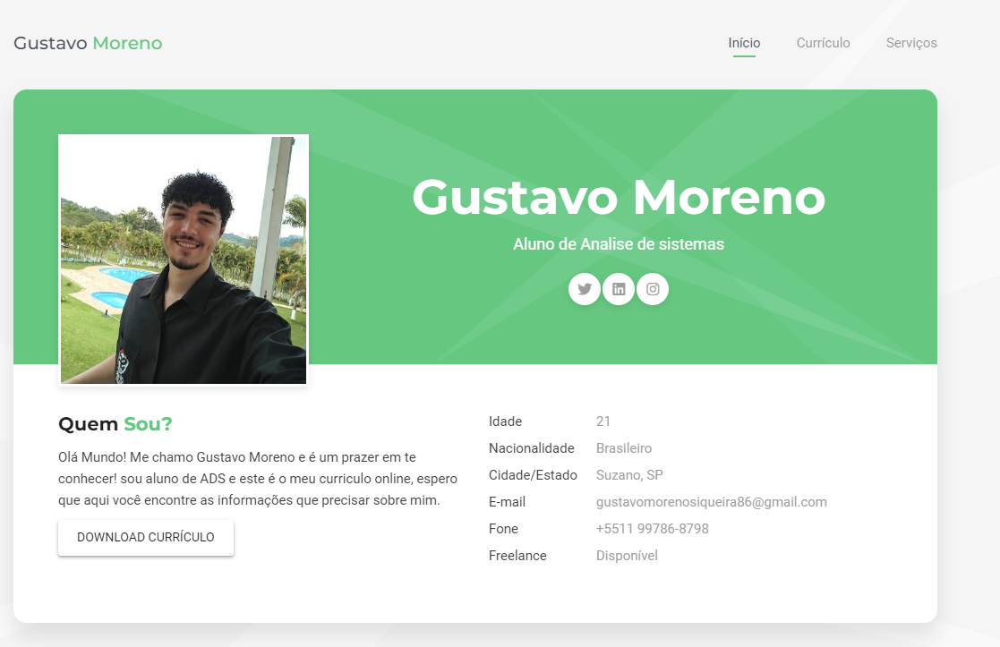

# Curriculo Online
> Este projeto é um curriculo Online onde podem ter acesso a minhas informações de contato.

Ao Clicar neste **[Link](https://gustavomsv.github.io/#home)** você tem acesso ao meu Curriculo Online, o objetivo deste projeto é facilitar o contato e a integração aos possiveis dados que precise obter sobre mim para contato, de uma forma mais fluida e centralizada, possibilitanto possiveis interessados terem facil acesso a mim e tambem verem um pouco do meu portfólio.  

## Exemplo de uso

Este projeto pode ser utilizado para incentivar pessoas a criarem o seu portfólio demonstrando suas habilidades de programação e Design.

## Contato

Gustavo Moreno - [Linkedin](https://www.linkedin.com/in/gustavo-moreno-5803a0229)

Meu e-mail: gustavomorenosiqueira86@gmail.com

Celular: (11) 99786-8798